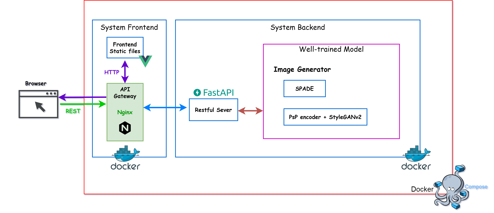
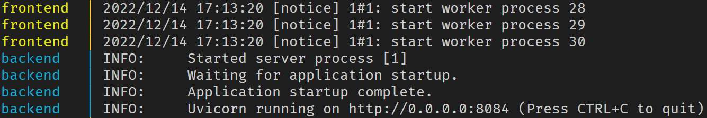
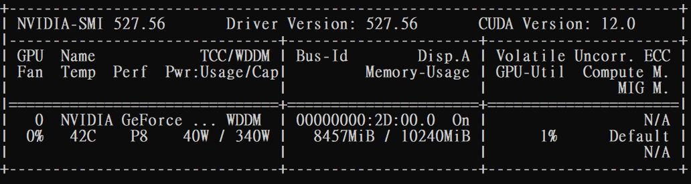
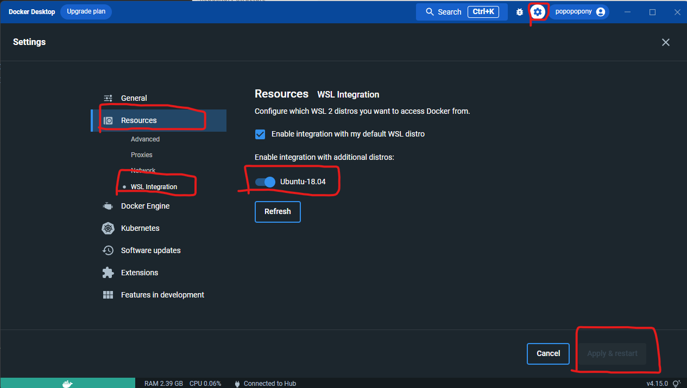
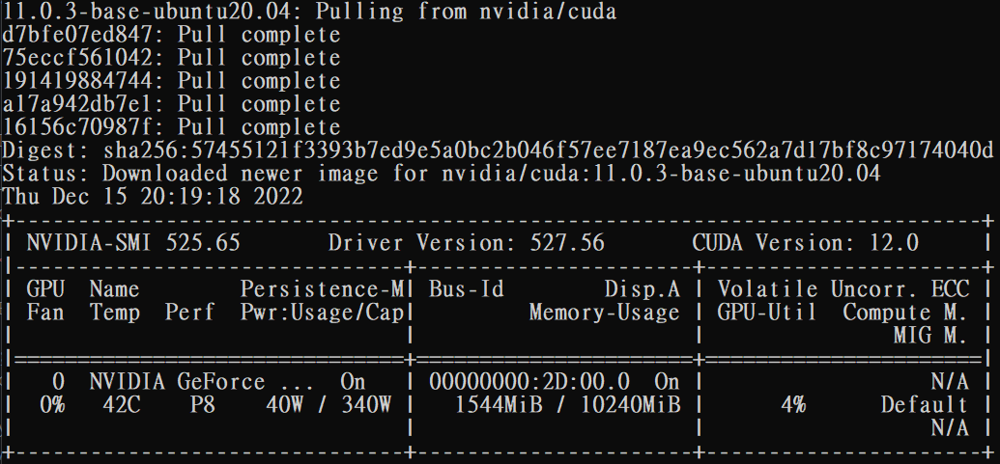
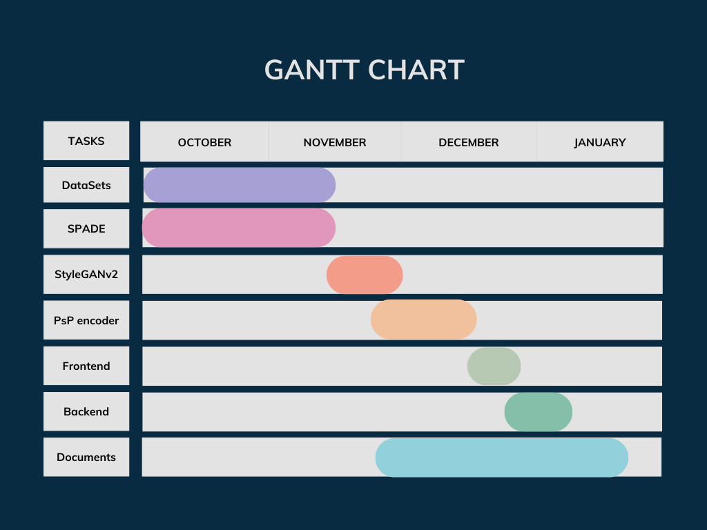

###### tags: `ccClub2022fall`

# Landscape Painter

> We provide a web application to transfer the image from a segmentation map to a photorealistic image. In the application, you can choose the SPADE or the PsP encoder with StyleGANv2 to generate your painting. We also provide the docker images and the checkpoint files that can build the application quickly on your own. 


<div style='text-align: center'>By default, we only provide 5 classes to draw. If you want to change the class, you can reference the <a href="https://groups.csail.mit.edu/vision/datasets/ADE20K/">ADE20K</a> document. <p><b>(Note that the drawing color is equal to the label color in ADE20K)</b></div>

## Table of Contents
- [Landscape Painter](#landscape-painter)
  - [Table of Contents](#table-of-contents)
  - [Goals](#goals)
  - [Architecture](#architecture)
  - [Getting Started](#getting-started)
    - [Prerequisites](#prerequisites)
    - [Installation](#installation)
    - [Nvidia GPU driver Installation](#nvidia-gpu-driver-installation)
    - [WSL2 Installation](#wsl2-installation)
    - [Docker Installation](#docker-installation)
  - [Repository Structure](#repository-structure)
  - [Project Timeline](#project-timeline)
  - [References](#references)


## Goals
1. Develop a web application
2. Build a demo page (with painter)
3. Transfer the image from a segmentation map to a photorealistic image
4. Provide docker images and well-trained checkpoint files 

## Architecture



## Getting Started
### Prerequisites
* Windows10 or Windows11 or Linux
* Nvidia GPU, driver need to be installed. (The tutorial in [here](#Nvidia-GPU-driver-Installation) may help you)
* For Windows user, WSL2 need to be installed. (The tutorial in [here](#WSL2-Installation) may help you)
* Docker installed. (The tutorial in [here](#Docker-Installation) may help you)


### Installation

1. Clone the project

```
git clone https://github.com/PoPoPoPony/LandscapePainter.git
```
* **Note that git should be installed**
* If you didn't install the git, please refer to https://git-scm.com/


2. Download the checkpoint files, check <a href="https://drive.google.com/file/d/1jcnEqMO_6UWjgC-EUvHPqHa_vgamvWoL/view?usp=share_link">here</a>

3. Unzip the ```ckpts.zip```in the ```LandscapePainter```, which will looks like [Repository structure](#Repository-Structure)

4. Run the docker compose command
```
cd LandscapePainter
```
```
docker-compose up
```
* **Note that Docker should be installed. (The tutorial in [here](#Docker-Installation) may help you)**
* If the frontend and the backend service run successfully, you can start painting!
    
* **Note that downloading the envirovment(almost 18G) and initializing the models(backend) take time. Go to have a cup of coffee first!**


### Nvidia GPU driver Installation
1. check your status. Open the CMD and enter : 
```
nvidia-smi
```

You can skip this part if the infomation of GPU driver shows successfully.


2. Go <a href="https://www.nvidia.com/zh-tw/geforce/drivers/">here</a> to check your GPU version and download the driver. You may need to reboost your computer.


### WSL2 Installation
Before using docker, the WSL2 needs to be prepared.

1. Allow these features and reboost your computer(「控制台」→「 程式集」→「開啟或關閉 Windows 功能」中，勾選其中兩項功能「Windows 子系統 Linux 版」與「虛擬機器平台」)

    

2. Install the WSL 
* Open the PowerShell with the admin, and enter : 
```
wsl --install -d Ubuntu
```
* After setting up the username and password, you can close the window


3. Set the WSL version to 2
* Open the CMD, and enter : 
```
wsl --set-version Ubuntu 2
```

    
4. (Optional) For Windows 10 user, if you can't update to WSL2, you can <a href="https://wslstorestorage.blob.core.windows.net/wslblob/wsl_update_x64.msi">download</a> the package and update manually


5. Check your WSL environment
* Open the CMD, and enter : 
```
wsl -l -v
```
* Make sure you have the WSL2 environment


### Docker Installation
1. Install Docker
* (For Windows user) While installing the docker, make sure the WSL2 option checked.
2. (For Windows user) Setting up the WSL backend
    
    * After setting up, restart the docker and check the new config has been applied

3. Check the environment using following command
```
docker run --rm --gpus all nvidia/cuda:11.0.3-base-ubuntu20.04 nvidia-smi
```
* If all settings are ready, the following infomation will be showed



## Repository Structure
| Path     | Description    |
| ------------------------------------------------- |:------------------------------------------------------------------------- |
| PsP    | Modules for training PsP encoder <br> We only implement the encoder part, others are refer to <br> <a href="https://github.com/eladrich/pixel2style2pixel">Official PsP encoder implmentation</a>      |
| SPADE       | Modules for SPADE  |
| backend  | Backend based on FastAPI  |
| frontend   | Frontend based on Vue and Element-plus3     |
| &boxv;&nbsp;&boxv;&nbsp;&boxvr;&nbsp; Painter.vue  | Setting up the painter. <br> If you want the change the class, please modify this file |
| posters   | Images in github readme     |
| stylegan2-pytorch   | Modules for training StyleGANv2 <br> The code is clone from <a href="https://github.com/rosinality/stylegan2-pytorch">rosinality's implementation</a>    |
| webcrawler_sophie   | Web crawler scripts provided by sophie     |
| webcrawler_wen   | Web crawler scripts provided by wen     |
| docker-compose.yml | docker compose file     |
| PsP_ckpt  | PsP checkpoint file     |
| &boxvr;&nbsp; iteration_200000.pt  | The checkpoint file for PsP encoder. You can set your own pt file after training your PsP encoder |
| SPADE_ckpt  | SPADE checkpoint file     |
| &boxvr;&nbsp; <text>epoche007.pt</text>  | The checkpoint file for SPADE. You can set your own pt file after training your SPADE |


## Project Timeline


## References
* Paper
    * Semantic Image Synthesis with Spatially-Adaptive Normalization
    * Encoding in Style: a StyleGAN Encoder for Image-to-Image Translation
    * A Style-Based Generator Architecture for Generative Adversarial Networks
    * Analyzing and Improving the Image Quality of StyleGAN
    * Real-time Semantic Segmentation Network Inspired from PID Controller

* Others
    * https://groups.csail.mit.edu/vision/datasets/ADE20K/
    * http://mmlab.ie.cuhk.edu.hk/projects/SFTGAN/
    * https://universome.github.io/alis
    * https://www.kaggle.com/datasets/arnaud58/landscape-pictures
    * https://github.com/NVlabs/SPADE
    * https://github.com/eladrich/pixel2style2pixel
    * https://github.com/rosinality/stylegan2-pytorch
    * https://hub.docker.com/_/node
    * https://hub.docker.com/_/nginx
    * https://hub.docker.com/r/pytorch/pytorch